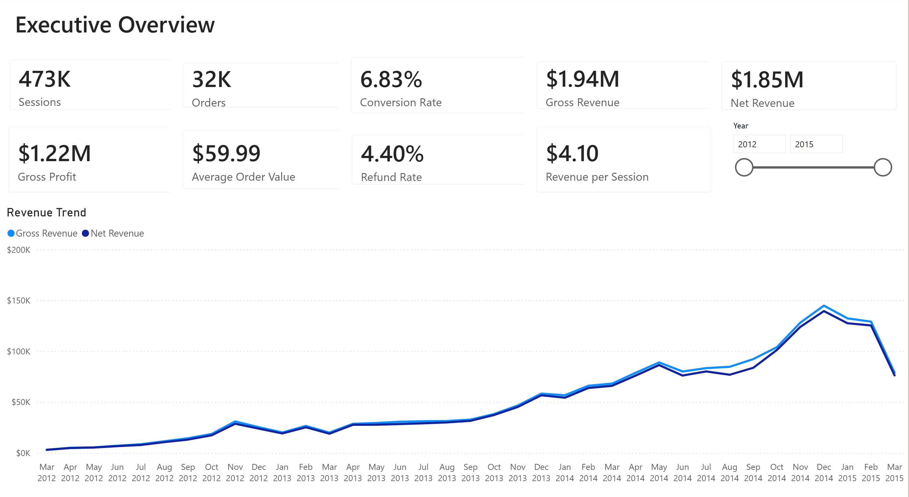
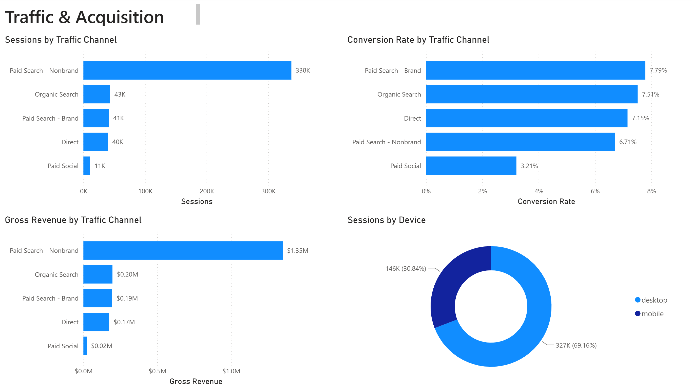
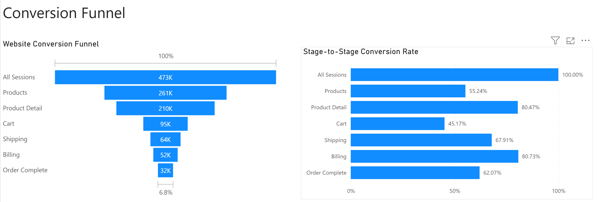
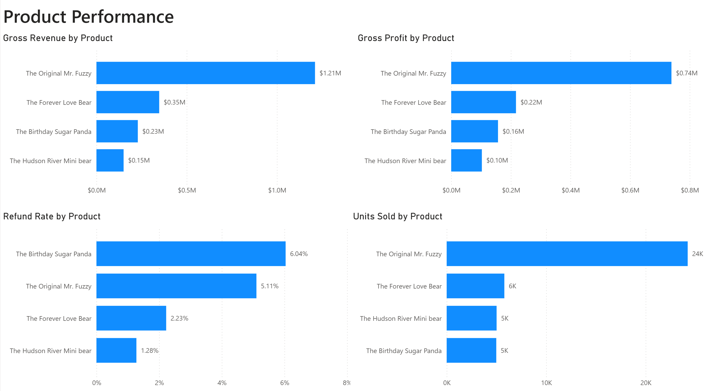

# E-Commerce Analytics Dashboard

An end-to-end e-commerce analytics project built with **Python, PostgreSQL, SQL, Power BI, and DAX** to analyze website traffic, conversion funnels, revenue, profitability, refunds, and product performance.

## Project Overview

This project analyzes an e-commerce business across the full customer journey, from website session through purchase and refund.

The workflow included data profiling in Python, transformation and validation in PostgreSQL, analytics-ready SQL views, Power BI data modeling, DAX measures, interactive dashboards, and business analysis.

## Tech Stack

- **Python / pandas** — data profiling and validation
- **PostgreSQL** — data storage, cleaning, transformations, and QA
- **SQL** — joins, business logic, funnel construction, and KPI validation
- **Power BI** — data modeling and dashboard development
- **DAX** — KPIs, conversion metrics, revenue metrics, and refund analysis
- **Git / GitHub** — version control and project documentation

## Key Metrics

| Metric | Result |
|---|---:|
| Website Sessions | 472,871 |
| Orders | 32,313 |
| Conversion Rate | 6.83% |
| Gross Revenue | $1,938,509.75 |
| Net Revenue | $1,853,171.06 |
| Gross Profit | $1,216,139.50 |
| Average Order Value | $59.99 |
| Refund Rate | 4.40% |
| Revenue per Session | $4.10 |

## Dashboard Pages

### Executive Overview

High-level view of business performance with interactive year filtering.



### Traffic & Acquisition

Analyzes customer acquisition channels, conversion efficiency, revenue contribution, and device mix.



### Conversion Funnel

Tracks customers through the purchase journey from session to completed order and measures conversion between funnel stages.



### Product Performance

Compares products across revenue, gross profit, refund rate, and units sold.



## Key Business Insights

### Paid Search - Nonbrand drives the majority of acquisition volume

Paid Search - Nonbrand generated approximately **338K sessions** and **$1.35M in gross revenue**, making it the largest acquisition channel.

Its conversion rate was approximately **6.71%**, however, which was lower than Paid Search - Brand, Organic Search, and Direct.

### Paid Search - Brand has the strongest conversion rate

Paid Search - Brand converted at approximately **7.79%**, the highest rate among the analyzed traffic channels.

### Product Detail to Cart is a major funnel drop-off

Stage-to-stage conversion rates showed:

| Funnel Transition | Conversion Rate |
|---|---:|
| All Sessions → Products | 55.24% |
| Products → Product Detail | 80.47% |
| Product Detail → Cart | 45.17% |
| Cart → Shipping | 67.91% |
| Shipping → Billing | 80.73% |
| Billing → Order Complete | 62.07% |

The **Product Detail → Cart** transition represents one of the largest opportunities for conversion optimization.

### Desktop dominates website traffic

Approximately **69% of sessions came from desktop** and **31% from mobile**.

### The Original Mr. Fuzzy is the primary revenue driver

The Original Mr. Fuzzy generated approximately:

- **24K units sold**
- **$1.21M gross revenue**
- **$0.74M gross profit**

It substantially outperformed the other products in sales volume, revenue, and profitability.

### Birthday Sugar Panda has the highest refund rate

The Birthday Sugar Panda had the highest product refund rate at approximately **6.04%**, suggesting an opportunity to investigate product expectations, quality, merchandising, or customer satisfaction.

## Data Model

The Power BI model uses analytics-ready PostgreSQL views at clearly defined grains:

- **Session Performance** — one row per website session
- **Session Funnel** — one row per session with funnel-stage indicators
- **Product Performance** — one row per order item
- **Funnel Performance** — aggregated funnel-stage metrics
- **Date** — dedicated calendar dimension

The model was validated to prevent duplicate revenue and ensure session, order, item, and refund totals reconciled across layers.

## DAX Measures

Measures created for the dashboard include:

- Sessions
- Orders
- Conversion Rate
- Gross Revenue
- Net Revenue
- Gross Profit
- Average Order Value
- Refund Rate
- Revenue per Session
- Product Refund Rate
- Units Sold
- Stage Conversion Rate

## Repository Structure

```text
ecommerce-analytics-dashboard/
│
├── Ecommerce_Analytics_Dashboard.pbix
├── README.md
│
├── notebooks/
│   └── ecommerce_data_pipeline.ipynb
│
├── sql/
│   └── ecommerce_analytics.sql
│
└── screenshots/
    ├── executive-overview.png
    ├── traffic-acquisition.png
    ├── conversion-funnel.png
    └── product-performance.png
```

## Project Files

**Power BI:** `Ecommerce_Analytics_Dashboard.pbix`  
Complete interactive Power BI report.

**Python:** `notebooks/ecommerce_data_pipeline.ipynb`  
Data exploration, profiling, missing-value analysis, duplicate checks, and data-quality validation.

**SQL:** `sql/ecommerce_analytics.sql`  
Consolidated PostgreSQL script containing cleaning logic, analytics views, funnel construction, reconciliation queries, and QA checks.

## Data

Raw source data is not stored in this repository. The repository focuses on the analytical workflow, transformations, validation, Power BI dashboard, and project documentation.
